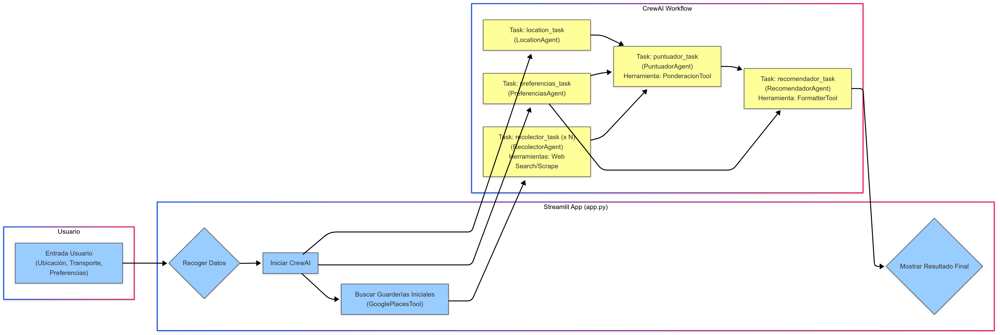

# 🧠 GuarderIA - Asistente Inteligente para Elegir Guardería

GuarderIA es una aplicación impulsada por agentes de IA que ayuda a familias a encontrar la mejor guardería para sus hijos, según sus preferencias, ubicación y prioridades.

---

## 🎯 Visión de Negocio

### Problema
Encontrar la guardería adecuada es un proceso complejo y que consume mucho tiempo para las familias. Requiere investigar múltiples opciones, comparar características (a menudo subjetivas o difíciles de encontrar), visitar centros y tomar una decisión basada en información dispersa y, a veces, incompleta.

### Solución
GuarderIA simplifica este proceso utilizando IA para:
- **Recopilar** información relevante sobre guarderías cercanas a la ubicación del usuario de forma persistente.
- **Interpretar** las prioridades y preferencias específicas de cada familia (expresadas en lenguaje natural).
- **Analizar** objetivamente cada guardería en función de esas prioridades, incluso con datos parciales.
- **Puntuar y comparar** las opciones de forma ponderada y detallada.
- **Recomendar** la opción más adecuada con una justificación clara y honesta sobre la calidad de los datos, ahorrando tiempo y estrés a las familias.

### Valor Añadido
- **Personalización:** Recomendaciones adaptadas a las necesidades únicas de cada familia.
- **Eficiencia:** Automatización de la búsqueda y análisis de información.
- **Objetividad Mejorada:** Puntuaciones basadas en criterios explícitos y lógica detallada aplicada a los datos recopilados.
- **Claridad y Transparencia:** Presentación de la información de forma estructurada, fácil de entender y transparente sobre las limitaciones de los datos.

---

## 🛠️ Visión Tecnológica

### Arquitectura General
GuarderIA se basa en una arquitectura de agentes autónomos orquestada por la librería `CrewAI`. La aplicación web se sirve mediante `Streamlit`.

1.  **Interfaz de Usuario (`Streamlit`):** Recoge la ubicación, preferencias de transporte y descripción en texto libre de las prioridades del usuario (`app.py`).
2.  **Orquestador (`CrewAI`):** Gestiona el flujo de ejecución secuencial de los agentes y sus tareas (`app.py`).
3.  **Agentes (`agents.py`):** Cada agente tiene un rol específico y utiliza herramientas para cumplir sus objetivos, con lógica mejorada para persistencia y manejo de datos.
4.  **Tareas (`tasks.py`):** Definen las instrucciones específicas que cada agente debe ejecutar, alineadas con los goals mejorados.
5.  **Herramientas (`tools/`):** Módulos reutilizables que interactúan con APIs externas (Google Maps, búsqueda web) o realizan funciones específicas (ponderación detallada, formato).

## 📊 Diagrama de Flujo



### Flujo de Ejecución
1.  **Entrada del Usuario:** Se recoge la dirección, transporte, tiempo máximo y preferencias en texto.
2.  **`LocationAgent` (`location_task`):** Extrae la información estructurada de ubicación/transporte.
3.  **`PreferenciasAgent` (`preferencias_task`):** Analiza el texto libre y genera un JSON con las puntuaciones de importancia (5 o 3) para cada criterio.
4.  **Búsqueda Inicial (Google Places):** Se utiliza `GooglePlacesTool` para encontrar guarderías cercanas según la ubicación, transporte y tiempo (`app.py`).
5.  **`RecolectorAgent` (`recolector_task` - *Ejecución múltiple y Persistente*):** Para cada guardería encontrada, este agente:
    - Intenta obtener información detallada usando `ScrapeWebsiteTool` (si se tiene una URL).
    - **Si falla el scraping**, no se rinde, sino que utiliza `SerperDevTool` y/o `WebsiteSearchTool` para buscar información *específica* faltante (horario, precios, contacto) o encontrar URLs alternativas.
    - Intenta rellenar un JSON detallado para cada guardería, priorizando valores estructurados (booleanos, números, listas).
6.  **`PuntuadorAgent` (`puntuador_task`):**
    - Recibe el JSON de preferencias y la lista de JSONs de todas las guarderías investigadas (del contexto).
    - Utiliza `PonderacionTool` (mejorada), que aplica una lógica de puntuación específica y más detallada por criterio (0-5), **sabiendo interpretar diccionarios anidados** (instalaciones, alimentación) y extraer datos numéricos de ratios y precios.
    - La herramienta devuelve una lista JSON ordenada por `score`, incluyendo `detalles_puntuacion` (con justificaciones) para cada criterio y guardería.
7.  **`RecomendadorAgent` (`recomendador_task`):**
    - Recibe la lista de guarderías puntuadas (con detalles) y el JSON de preferencias (del contexto).
    - Analiza los resultados (`score` y `detalles_puntuacion`), compara las mejores opciones basándose en los criterios importantes para el usuario.
    - **Si los datos son pobres o las puntuaciones bajas**, genera un informe que **indica estas limitaciones** de forma transparente.
    - Genera un informe final en Markdown con la recomendación justificada (basada en los datos disponibles), pros y contras. Puede usar `FormatterTool` para mejorar la presentación.
8.  **Salida:** El informe Markdown se muestra al usuario en la interfaz de Streamlit.

### Componentes Clave y Herramientas Actualizadas
- **`crewai` & `crewai-tools`:** Framework para la orquestación de agentes y tareas. (Versiones flexibles en `requirements.txt`).
- **`streamlit`:** Creación de la interfaz web interactiva.
- **`langchain`, `langchain-core`, `langchain-community`, `langchain-openai`:** Dependencias para la inteligencia de los agentes (LLM). (Versiones flexibles en `requirements.txt`).
- **`openai` (`ChatOpenAI`):** Modelo LLM (o3-mini por defecto) para los agentes.
- **`GooglePlacesTool`:** Interfaz con la API de Google Maps para buscar guarderías y calcular tiempos de viaje.
- **`SerperDevTool`, `ScrapeWebsiteTool`, `WebsiteSearchTool`:** Herramientas para la búsqueda web y extracción de contenido, usadas de forma más persistente por el `RecolectorAgent`.
- **`PonderacionTool` (Mejorada):** Lógica personalizada para calcular la puntuación ponderada (0-5) **manejando diccionarios anidados** (instalaciones, alimentación, etc.), extrayendo datos numéricos y aplicando reglas específicas. Devuelve una lista JSON ordenada con `nombre`, `score` y `detalles_puntuacion`.
- **`FormatterTool`:** Herramienta opcional para ayudar al `RecomendadorAgent` a formatear la salida en Markdown.
- **Logging:** Se configura un logging detallado en `crew_execution.log` para depuración (`app.py`).

---

## 🚀 Requisitos

- **Python 3.11 o superior:** Necesario debido a dependencias que usan características recientes de Python (como `typing.Self`).
- OpenAI API Key
- Google Maps API Key
- Serper API Key

---

## 📦 Instalación

1. Clona este repositorio y accede a la carpeta del proyecto:

```bash
git clone https://github.com/anabuigues/guarderIA
cd guarderIA
```

2. Crea y activa un entorno virtual **usando Python 3.11 o superior** (muy recomendado):

```bash
# Asegúrate de usar el comando para tu versión de Python 3.11+
python3.11 -m venv .venv # o python3.12 -m venv .venv
source .venv/bin/activate  # En Windows: .venv\Scripts\activate
```
*Nota: Evita crear el entorno si tienes un entorno base de Conda activo para prevenir conflictos.* Desactívalo primero (`conda deactivate`).

3. Actualiza pip e instala las dependencias:

```bash
python -m pip install --upgrade pip
pip install -r requirements.txt
```
*Nota: `requirements.txt` ahora tiene versiones flexibles para `crewai` y `langchain` para mejorar la compatibilidad.* 

---

## 🔐 Configuración de variables de entorno

Crea un archivo `.env` en la raíz del proyecto (puedes copiar `.env.example`) con tus claves API:

```dotenv
OPENAI_API_KEY=sk-...
GOOGLE_MAPS_API_KEY=AIzaSy...
SERPER_API_KEY=...
```

---

## 🖥️ Ejecutar la app en Streamlit

Asegúrate de que tu entorno virtual (`.venv`) está activado:

```bash
streamlit run app.py
```

---

## ✨ Qué hace GuarderIA (Resumen Funcional)

1. El usuario describe lo que valora en una guardería, junto con su ubicación y preferencias de transporte.
2. El sistema busca guarderías cercanas usando Google Maps.
3. Cada guardería es investigada online por un agente especializado (`RecolectorAgent`) de forma **persistente**, intentando superar errores de scraping.
4. Las preferencias del usuario se convierten en pesos numéricos (`PreferenciasAgent`).
5. Las guarderías se puntúan de forma **más detallada y robusta** según la información encontrada y los pesos del usuario (`PuntuadorAgent` usando `PonderacionTool` mejorada).
6. El sistema recomienda la mejor opción, explicando detalladamente por qué y **siendo transparente sobre la calidad de los datos** (`RecomendadorAgent`).

---

## 🧩 Agentes Implementados (Resumen Técnico)

| Agente               | Rol                                                                 | Tarea Principal (`tasks.py`) | Herramientas Clave (`tools/`)        |
|----------------------|----------------------------------------------------------------------|-------------------------------|---------------------------------------|
| `LocationAgent`      | Extrae ubicación/transporte del usuario.                             | `location_task`               | `GooglePlacesTool` (usada en `app.py`) |
| `PreferenciasAgent`  | Convierte preferencias en texto a pesos JSON.                       | `preferencias_task`           | -                                     |
| `RecolectorAgent`    | Investiga online **persistentemente** cada guardería y rellena perfil JSON. | `recolector_task`             | `SerperDevTool`, `ScrapeWebsiteTool`, `WebsiteSearchTool` |
| `PuntuadorAgent`     | Calcula puntuación ponderada **detallada** usando `PonderacionTool` mejorada. | `puntuador_task`              | `PonderacionTool`                    |
| `RecomendadorAgent`  | Genera informe Markdown final con análisis, **manejando datos pobres**. | `recomendador_task`           | `FormatterTool` (opcional)           |
*Nota: La orquestación la maneja `CrewAI` directamente en `app.py`.*

---

## 📬 Contribuciones

¡Sugerencias, mejoras o PRs son más que bienvenidos!

---

## 📄 Licencia

MIT © 2025